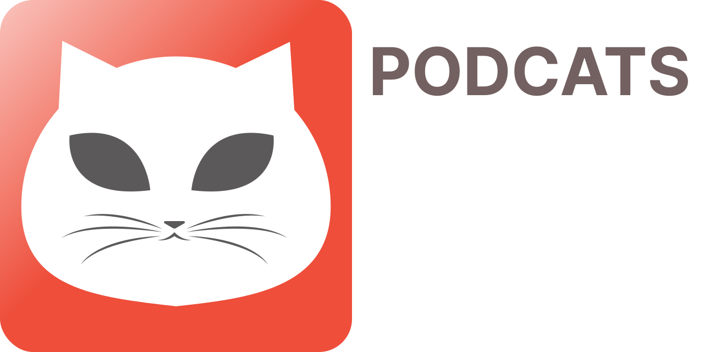

# **Podcats**
Only for non-commercial use

> **Multiplatform podcast application**

  

## **User Roles**
**User Role** | **Description**
------------- | -------------
**`Client`**  | User of the app
**`Podcast`**  | Channel of Shows
**`Episode`**  | Single show
**`Genre`**  | Genre of Podcast

## **Features List**
**Feature**                 | **Link on documentation (specs, use cases)**
--------------------------- | -----------------------------------------------
**`Podcasts Genres List`** | [Genres List specs](PodcastsComponents/PodcastsGenresList%20Feature/PodcastsGenresList/README.md)